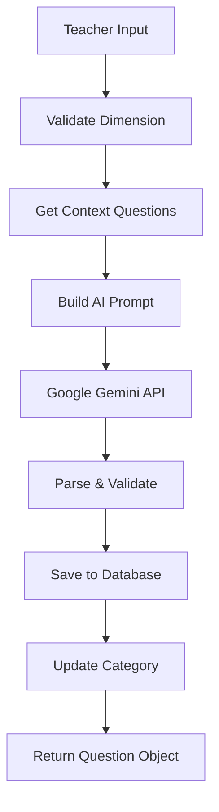

# 🎓 Quiz API Backend with AI Question Generation

A FastAPI-based backend system for educational quizzes with integrated AI question generation using Google Gemini.

## 🚀 Quick Start

### Prerequisites
- Python 3.10+
- Conda environment
- Google Gemini API key
- Firebase credentials

### Setup & Run
```bash
cd "c:\Users\ahmed\Desktop\Stage Esprit\Stage\Deployments\Backend"

# Activate conda environment
conda activate ./.conda

# Start the server
python -m uvicorn src.main:app --reload --host 0.0.0.0 --port 8000
```

### Access Points
- **API Server**: http://localhost:8000
- **Swagger Documentation**: http://localhost:8000/docs
- **ReDoc**: http://localhost:8000/redoc

## 🏗️ Architecture

### Core Components
- **FastAPI**: Modern web framework for building APIs
- **Firebase**: NoSQL database for data persistence
- **Google Gemini**: AI model for question generation
- **Sentence Transformers**: Semantic search and embeddings
- **FAISS**: Vector similarity search

### Database Collections
- `questions` - Generated and manual questions
- `quizzes` - Quiz metadata and configuration
- `categories` - Question categories and subcategories
- `answers` - Student responses
- `scores` - Assessment results

## 🤖 AI Question Generation System

### Overview
The system uses Google Gemini AI with Retrieval-Augmented Generation (RAG) to create contextually appropriate 5-point Likert scale questions.

### Features
- ✅ **Dimension-Specific Generation**: Tailored prompts for creativity, soft skills, teamwork, etc.
- ✅ **Custom Subdimensions**: Teachers can create new subcategories not in the dataset
- ✅ **Smart Context Retrieval**: Uses semantic search for relevant examples
- ✅ **Proper Model Integration**: Generates valid Question objects with correct IDs
- ✅ **Auto-Category Updates**: Automatically adds new subdimensions to categories
- ✅ **Balanced Dataset**: Uses production dataset with 880 balanced questions (220 per dimension)

### Dataset Integration
The AI system uses the **balanced production dataset** located at:
```
../../Datasets/Final Datasets/All Questions.csv
```

**Dataset Features:**
- 🎯 **880 Questions**: Perfectly balanced across 4 dimensions
- 📊 **Equal Distribution**: 220 questions each (creativity, soft_skills, teamwork, hard_skills)
- ✅ **Clean Format**: 5 columns, standardized Likert scale (1-5)
- 🏷️ **Rich Subdimensions**: 60+ specialized subcategories
- 🎓 **Year-Level Coverage**: Questions for Years 1-3

**Columns:**
```csv
question_id,dimension,subdimension,question_text,target_year_level
sa_001,creativity,innovation_problem_solving,How confident are you in innovation problem solving?,1
```

**No `response_scale` column needed** - all questions use standard 1-5 Likert scale.

### Generation Flow


### Supported Dimensions
- **Creativity**: Innovation problem solving, algorithm design, UX design, system architecture
- **Soft Skills**: Time management, critical thinking, adaptability, presentation communication
- **Teamwork**: Communication documentation, code review collaboration, conflict resolution, leadership mentoring, agile participation
- **Hard Skills**: Programming languages, database management, DevOps deployment, testing QA

## 📡 API Endpoints

### Questions
- `GET /questions/` - List all questions
- `POST /questions/` - Create a new question
- `GET /questions/{id}` - Get specific question
- `PUT /questions/{id}` - Update question
- `DELETE /questions/{id}` - Delete question
- `GET /questions/by_quiz/{quiz_id}` - Get questions by quiz
- `GET /questions/search/?keyword={keyword}` - Search questions

### AI Generation
- `GET /questions/dimensions` - Get available dimensions
- `GET /questions/subdimensions/{dimension}` - Get subdimensions for dimension
- `POST /questions/generate` - Generate single AI question
- `POST /questions/generate-category` - Generate multiple questions for one category
- `POST /questions/generate-full-quiz` - Generate balanced quiz across 4 major categories

#### Single Question Generation
```json
{
  "idQuiz": "actual_quiz_id_from_database",
  "idCategory": "actual_category_id_from_database", 
  "subdimension": "optional_custom_subdimension",
  "target_year_level": 2
}
```

#### Category Questions Generation
```json
{
  "idQuiz": "actual_quiz_id_from_database",
  "idCategory": "actual_category_id_from_database",
  "num_questions": 10,
  "target_year_level": 2
}
```

#### Full Quiz Generation
```json
{
  "idQuiz": "actual_quiz_id_from_database", 
  "total_questions": 40,
  "target_year_level": 2
}
```

**Auto-Detection Features:**
- **Dimension**: Automatically pulled from category's `island` field
- **Subdimension**: Uses provided subdimension OR auto-selects from category OR falls back to dataset
- **Quiz/Category Validation**: Verifies IDs exist in database before generation

#### Generation Response Format
```json
{
  "question": {
    "idQuestion": "auto_generated_firebase_id",
    "content": "I am confident in my ability to solve problems creatively.",
    "idQuiz": "actual_quiz_id_from_database",
    "idCategory": "actual_category_id_from_database"
  },
  "generation_metadata": {
    "dimension": "creativity",
    "subdimension": "innovation_problem_solving",
    "target_year_level": 2,
    "response_scale": "1-5"
  }
}
```

### Bulk Generation Features

#### Category Questions Generation (`/questions/generate-category`)
Generates multiple questions for a single category with automatic subdimension distribution:

**Features:**
- 🎯 **Smart Distribution**: Questions are evenly distributed across available subdimensions
- 📊 **Balanced Allocation**: Handles any number of questions (1-50) with fair distribution
- 🔄 **Variation**: Each question is unique using context variation
- 📋 **Metadata Tracking**: Full distribution statistics in response

**Example: Generate 10 creativity questions**
```bash
curl -X POST "http://localhost:8000/questions/generate-category" \
  -H "Content-Type: application/json" \
  -d '{
    "idQuiz": "quiz_123",
    "idCategory": "creativity_category_id",
    "num_questions": 10,
    "target_year_level": 2
  }'
```

**Response includes:**
- Array of 10 saved Question objects
- Subdimension distribution (e.g., 3 innovation, 3 artistic, 4 original_thinking)
- Generation metadata

#### Full Quiz Generation (`/questions/generate-full-quiz`)
Generates a complete balanced quiz across all 4 major categories:

**Features:**
- 🎯 **Perfect Balance**: Equal questions per category (creativity, teamwork, soft_skills, hard_skills)
- 📊 **Auto-Distribution**: Each category's questions distributed across its subdimensions
- ✅ **Validation**: Total questions must be divisible by 4
- 🎓 **Year-Level Specific**: All questions target the specified year level

**Example: Generate 40-question balanced quiz**
```bash
curl -X POST "http://localhost:8000/questions/generate-full-quiz" \
  -H "Content-Type: application/json" \
  -d '{
    "idQuiz": "quiz_123",
    "total_questions": 40,
    "target_year_level": 2
  }'
```

**Response includes:**
- Array of 40 saved Question objects (10 per category)
- Complete category distribution mapping
- Subdimension breakdown for each category
- Category-to-quiz mapping information

**🔗 Schema Integration:**
- Generated questions use your existing `Question` schema exactly
- Questions are automatically saved to your Firebase `questions` collection
- All relationships (`idQuiz`, `idCategory`) are maintained properly
- Generated questions work with your existing quiz display and answer collection systems

## 🅰️ Angular Frontend Integration

### LLM Integration Overview

The AI question generation system is **fully integrated** with your existing database schemas:
- Generated questions are automatically saved as `Question` objects in Firebase
- All relationships (`idQuiz`, `idCategory`) are maintained properly
- Generated questions work seamlessly with your existing quiz system

### Quick Setup

#### 1. Create Service
```typescript
// services/quiz-api.service.ts
import { Injectable } from '@angular/core';
import { HttpClient } from '@angular/common/http';
import { Observable } from 'rxjs';

export interface QuestionGenerateRequest {
  idQuiz: string;
  idCategory: string;
  subdimension?: string;
  target_year_level: number;
}

@Injectable({
  providedIn: 'root'
})
export class QuizApiService {
  private baseUrl = 'http://localhost:8000';

  constructor(private http: HttpClient) {}

  // Generate AI question
  generateQuestion(request: QuestionGenerateRequest): Observable<any> {
    return this.http.post(`${this.baseUrl}/questions/generate`, request);
  }

  // Get available dimensions
  getDimensions(): Observable<{dimensions: string[]}> {
    return this.http.get<{dimensions: string[]}>(`${this.baseUrl}/questions/dimensions`);
  }

  // Get subdimensions for a dimension
  getSubdimensions(dimension: string): Observable<{subdimensions: string[]}> {
    return this.http.get<{subdimensions: string[]}>(`${this.baseUrl}/questions/subdimensions/${dimension}`);
  }

  // Get existing data
  getQuizzes(): Observable<any[]> {
    return this.http.get<any[]>(`${this.baseUrl}/quizzes/`);
  }

  getCategories(): Observable<any[]> {
    return this.http.get<any[]>(`${this.baseUrl}/categories/`);
  }
}
```

#### 2. Basic Component Example
```typescript
// component.ts
export class QuestionGeneratorComponent {
  constructor(private quizApi: QuizApiService) {}

  generateQuestion() {
    const request = {
      idQuiz: "your_quiz_id",
      idCategory: "your_category_id", 
      subdimension: "optional_custom_subdimension", // Leave empty for auto-detection
      target_year_level: 2
    };

    this.quizApi.generateQuestion(request).subscribe(response => {
      console.log('Generated question:', response.question.content);
      // Question is automatically saved to database
    });
  }
}
```

### Integration Scenarios

#### 🎯 Generate Complete Quiz
```typescript
// Generate questions for all subdimensions in a category
async generateCompleteQuiz(quizId: string, categoryId: string) {
  // 1. Get category dimension
  const categories = await this.quizApi.getCategories().toPromise();
  const category = categories.find(c => c.idCategory === categoryId);
  
  // 2. Get all subdimensions
  const subdimensions = await this.quizApi.getSubdimensions(category.island).toPromise();
  
  // 3. Generate questions for each subdimension
  const questions = [];
  for (const subdimension of subdimensions.subdimensions) {
    const response = await this.quizApi.generateQuestion({
      idQuiz: quizId,
      idCategory: categoryId,
      subdimension: subdimension,
      target_year_level: 2
    }).toPromise();
    questions.push(response);
  }
  
  return questions;
}
```

#### 🎯 Generate for Specific Subdimensions
```typescript
// Generate questions for specific subdimensions only
async generateForSubdimensions(quizId: string, categoryId: string, targetSubs: string[]) {
  const questions = [];
  
  for (const subdimension of targetSubs) {
    const response = await this.quizApi.generateQuestion({
      idQuiz: quizId,
      idCategory: categoryId,
      subdimension: subdimension,
      target_year_level: 2
    }).toPromise();
    questions.push(response);
  }
  
  return questions;
}

// Usage: generateForSubdimensions(quizId, categoryId, ['innovation_problem_solving', 'artistic_expression'])
```

#### 🎯 Custom Teacher Subdimensions
```typescript
// Teachers create their own subdimensions not in the dataset
async generateCustomSubdimensions(quizId: string, categoryId: string, customSubs: string[]) {
  const questions = [];
  
  for (const customSubdimension of customSubs) {
    // API automatically adds these to the category
    const response = await this.quizApi.generateQuestion({
      idQuiz: quizId,
      idCategory: categoryId,
      subdimension: customSubdimension, // e.g., "musical_creativity"
      target_year_level: 2
    }).toPromise();
    questions.push(response);
  }
  
  return questions;
}

// Usage: generateCustomSubdimensions(quizId, categoryId, ['musical_creativity', 'digital_storytelling'])
```

#### 🎯 Progressive Difficulty
```typescript
// Generate questions with increasing difficulty levels
async generateProgressiveQuiz(quizId: string, categoryId: string) {
  const questions = [];
  const subdimensions = ['innovation_problem_solving', 'artistic_expression'];
  
  // Generate for each difficulty level
  for (let level = 1; level <= 3; level++) {
    for (const sub of subdimensions) {
      const response = await this.quizApi.generateQuestion({
        idQuiz: quizId,
        idCategory: categoryId,
        subdimension: sub,
        target_year_level: level
      }).toPromise();
      questions.push(response);
    }
  }
  
  return questions;
}
```

#### 🎯 Auto-Detection Mode
```typescript
// Let the system auto-detect dimension and subdimension from category
async generateWithAutoDetection(quizId: string, categoryId: string, count: number = 5) {
  const questions = [];
  
  for (let i = 0; i < count; i++) {
    // No subdimension specified - system auto-detects from category
    const response = await this.quizApi.generateQuestion({
      idQuiz: quizId,
      idCategory: categoryId,
      target_year_level: 2
    }).toPromise();
    questions.push(response);
  }
  
  return questions;
}
```

### Error Handling
```typescript
// Basic error handling
generateWithErrorHandling(request) {
  this.quizApi.generateQuestion(request).subscribe({
    next: (response) => {
      console.log('Generated:', response.question.content);
    },
    error: (error) => {
      if (error.status === 404) {
        console.error('Quiz or Category not found');
      } else {
        console.error('Generation failed:', error);
      }
    }
  });
}
```

### Other Endpoints

### Categories
- `GET /categories/` - List all categories
- `POST /categories/` - Create a new category
- `GET /categories/{id}` - Get specific category
- `PUT /categories/{id}` - Update category
- `DELETE /categories/{id}` - Delete category

**Category Schema:**
```json
{
  "island": "creativity",
  "subcategories": ["innovation_problem_solving", "artistic_expression"]
}
```

### Quizzes
- `GET /quizzes/` - List all quizzes
- `POST /quizzes/` - Create a new quiz
- `GET /quizzes/{id}` - Get specific quiz
- `PUT /quizzes/{id}` - Update quiz
- `DELETE /quizzes/{id}` - Delete quiz

**Quiz Schema:**
```json
{
  "idTeacher": "teacher_001",
  "idCategory": ["cat1", "cat2", "cat3", "cat4"],
  "dateCreation": "2025-01-27T10:30:00",
  "isAccessible": true,
  "accessCode": "QUIZ123",
  "nameQuiz": "Creativity Assessment Quiz"
}
```

### Answers & Scores
- `GET /answers/` - List all answers
- `POST /answers/` - Submit an answer
- `GET /answers/by_quiz/{quiz_id}` - Get answers for a quiz
- `GET /scores/` - List all scores
- `POST /scores/` - Calculate and save scores

## 🔧 Configuration

### Environment Variables
```env
GEMINI_API_KEY=your_google_gemini_api_key
FIREBASE_CREDENTIALS=path_to_firebase_credentials.json
```

### Dataset Requirements
The system expects a questions dataset at:
```
../../Datasets/Quiz Generation/questions.csv
```

## 🧪 Testing

### Run Comprehensive Test
```bash
python test_comprehensive.py
```

### Test Individual Endpoints
```bash
# Get dimensions
curl -X GET "http://localhost:8000/questions/dimensions"

# Get subdimensions
curl -X GET "http://localhost:8000/questions/subdimensions/creativity"

# Generate question
curl -X POST "http://localhost:8000/questions/generate" \
  -H "Content-Type: application/json" \
  -d '{
    "idQuiz": "your_quiz_id",
    "idCategory": "your_category_id",
    "target_year_level": 2
  }'
```

##  Common Issues
- **CORS errors**: Ensure backend is running with proper CORS configuration
- **Generation timeouts**: AI generation takes 10-30 seconds, implement loading states
- **Invalid IDs**: Always validate quiz/category IDs exist before generating questions

## 📝 License
This project is part of the Stage Esprit internship program.

---
*Built with ❤️ using FastAPI, Google Gemini AI, Firebase, and Angular*