# 🌐 TeamGame – Branche Web

## 📌 Description

La branche **Web** du projet **TeamGame** regroupe :

- **Frontend Angular 16** : Interface enseignant avec dashboard interactif, gestion des étudiants, gestion des quiz, avatars, groupes, calendrier et chatbot.
- **Backend API Platform (Symfony)** : Gestion des utilisateurs (enseignants & étudiants), import CSV, statistiques, authentification (Firebase + Google).
- **Firebase** : Utilisé comme système d’authentification et de stockage.
- **Backend FastAPI (complémentaire,branche Backend)** : Gestion des quiz, avatars, groupes (clustering).

---

## 🚀 Fonctionnalités

### 🔹 Frontend Angular 16

**Technologie : Angular 16**

#### 📂 Dossiers principaux :
```
src/app/
 ├── accueil/             # Page d’accueil avec statistiques
 ├── avatar-list/         # Gestion des avatars & scores (FastAPI)
 ├── calendar/            # Calendrier (FullCalendar)
 ├── chatbot/             # Chatbot IA (Gemini + mydata.json)
 ├── groupes/             # Gestion des groupes (FastAPI clustering)
 ├── guards/              # Guards de rôles et permissions
 ├── quiz-dashboard/      # CRUD Quiz, catégories,sous-catégories, question, filtres (FastAPI)
 ├── services/            # Services Angular (user,score,quiz,question,password-reset,cluster,category,badge,avatar)
 ├── student-import/      # Import CSV étudiants (API Platform)
 ├── user/                # Login, register, profil, reset-password (API Platform + Firebase)
 ├── app-routing.module.ts 
 ├── app.component.ts / .html / .css # Sidebar
 └── app.module.ts
```

#### 📊 Fonctionnalités principales :
- **Dashboard interactif (enseignants)**
- **Accueil** : Statistiques (catégories, genres, quiz en attente, quiz complétés)
- **Avatars (AvatarList)** : Classement des étudiants avec îles, badges, scores, quiz *(via FastAPI)*
- **Groupes** : Clustering automatique (CSV) + ajout/suppression manuelle *(via FastAPI)*
- **Quiz** :
  - CRUD complet (catégories, sous-catégories, quiz accessibles ou non)
  - Questions manuelles ou générées par IA Gemini
  - Filtres 
- **Calendrier** : Visualisation des quiz avec **FullCalendar**
- **Import Étudiants (CSV)** : Affectation automatique aux classes + génération d’identifiants sécurisés envoyés par mail *(via API Platform)*
- **Utilisateurs** :
  - Inscription / Connexion
  - Connexion via Google
  - Réinitialisation mot de passe (Firebase email)
  - Gestion du profil (ajout photo, mise à jour infos)
- **Chatbot** :
  - Mode FAQ via fichier `mydata.json`
  - Mode **IA** (Gemini API)
- **Guards Angular** : Protection des routes selon rôle (enseignant/étudiant)

---

### 🔹 Backend API Platform (Symfony)

**Technologie : Symfony 6.4 + API Platform 3.4**

#### 📂 Dossiers principaux :
```
config/
 ├── firebase_credentials.json   # Identifiants Firebase Admin
 ├── routes.yaml                 # Routing Symfony
 ├── services.yaml               # Déclaration des services

src/
 ├── ApiResource/                
 ├── Controller/                 
 │    ├── LoginController.php          # Connexion utilisateur
 │    ├── PasswordResetController.php  # Reset mot de passe
 │    ├── RegisterController.php       # Inscription
 │    ├── RegisterGoogleController.php # Auth via Google
 │    ├── StatController.php           # Statistiques
 │    └── StudentImportController.php  # Import CSV étudiants
 ├── Entity/                      
 ├── Repository/                
 └── Service/                    
      ├── EmailService.php        # Envoi d’emails
      └── FirebaseRestService.php # Communication Firebase
```

#### 📊 Fonctionnalités principales :
- **Gestion Utilisateurs** :
  - Register / Login / Reset Password / Update Profile
  - Authentification via Google
  - Rôles : enseignant, étudiant
- **Import Étudiants (CSV)** :
  - Affectation à une classe
  - Génération identifiant + mot de passe sécurisé
  - Envoi automatique d’un mail avec identifiants
- **Statistiques** utilisateurs & classes
- **Firebase** utilisé comme système d’authentification et stockage
---

## 
## 📚 Bibliothèques utilisées

### 🔹 Frontend Angular 16
- **@angular/fire** → intégration Firebase  
- **firebase** → SDK officiel Firebase  
- **@fullcalendar/angular**, **@fullcalendar/core**, **@fullcalendar/daygrid** → calendrier (planning quiz)  
- **angular-calendar** + **date-fns** → gestion avancée des événements et dates  
- **bootstrap** → UI responsive  
- **chart.js** → graphiques statistiques  
- **apexcharts** → visualisations interactives (charts avancés)  
- **d3** → manipulation et visualisation de données  
- **css-select** → utilitaire de sélection CSS (extraction/parsing de DOM)  

---

### 🔹 Backend API Platform (Symfony)
- **api-platform/doctrine-orm** & **api-platform/symfony** → API REST/GraphQL  
- **kreait/firebase-php** → SDK Firebase pour PHP  
- **google/auth** → Authentification Google OAuth  
- **nelmio/cors-bundle** → gestion CORS (API cross-domain)  
- **symfony/mailer** → envoi d’emails (reset password, notifications)  
- **symfony/http-client** → appels API externes (Firebase, Google, etc.)  
- **symfony/uid** → UUID & identifiants uniques  

⚙️ Installation & Lancement

### 1️⃣ Cloner le projet
```bash
git clone https://github.com/badi3a/TeamGame.git
cd TeamGame
git checkout Web
```

### 2️⃣ Lancer le Frontend Angular
```bash
cd "Frontend Angular"
npm install
ng serve
```
➡️ Accessible sur : [http://localhost:4200](http://localhost:4200)

### 3️⃣ Lancer le Backend API Platform (Symfony)
```bash
cd "Backend ApiPlateforme"
composer install
symfony server:start --port=8001
```
➡️ Accessible sur : [http://127.0.0.1:8001](http://127.0.0.1:8001)

---

## 🔑 Configuration

### 📂 `environment.ts` (Angular)
```ts
export const environment = {
  production: false,
  firebase: {
    apiKey: "XXXX",
    authDomain: "quizmaster-XXXX.firebaseapp.com",
    projectId: "quizmaster-XXXX",
    storageBucket: "quizmaster-XXXX.appspot.com",
    messagingSenderId: "XXXX",
    appId: "XXXX",
    measurementId: "XXXX"
  },
  GEMINI_API_KEY: "XXXX"
};
```

### 📂 `firebase_credentials.json` (API Platform)
Clé **Service Account Firebase** pour :  
- Authentification utilisateurs  
- Stockage complémentaire  

---

## 📊 Aperçu des Ports
- **Frontend Angular** → [http://localhost:4200](http://localhost:4200)  
- **Backend FastAPI** → [http://127.0.0.1:8000](http://127.0.0.1:8000)  
- **Backend API Platform (Symfony)** → [http://127.0.0.1:8001](http://127.0.0.1:8001)  

---

## 🖥️ Interfaces principales
- **Login** :
  
  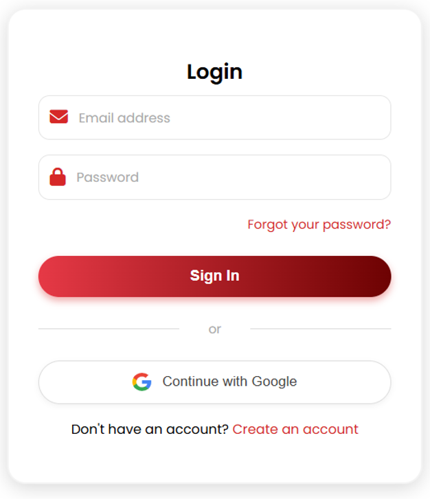

- **Mot de passe oublié** :
  
  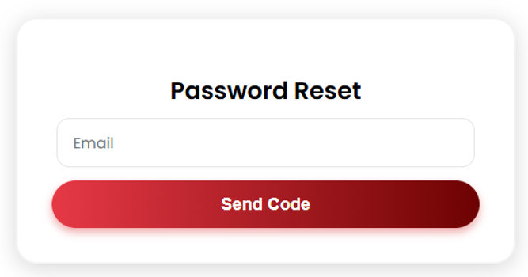

- **Inscription** :
  
  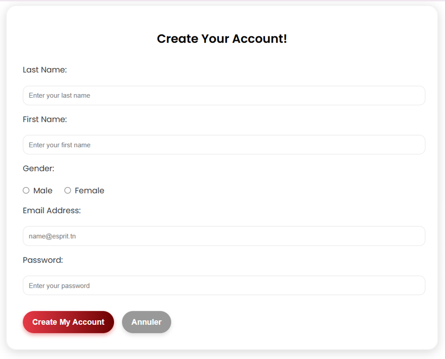

- **Dashboard** :
  
  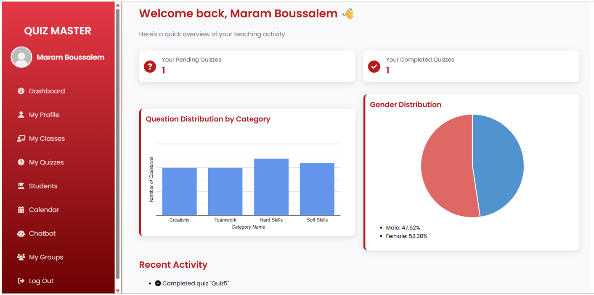

- **My Profile** :
  
  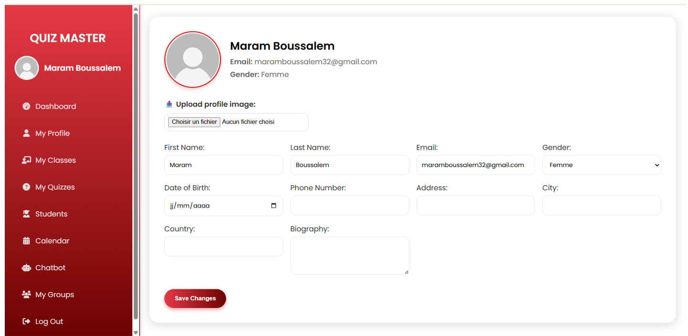

- **My Classes** : 
  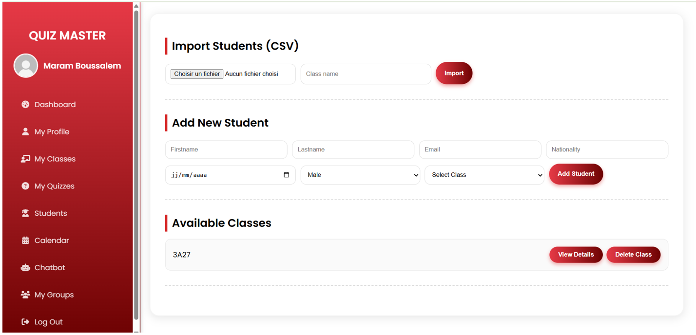
  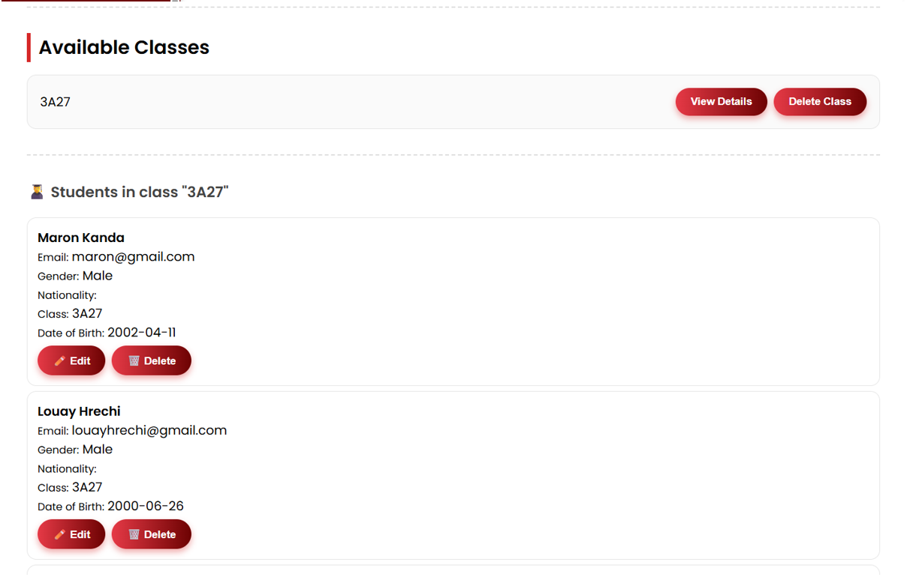

- **My Quizzes** :
  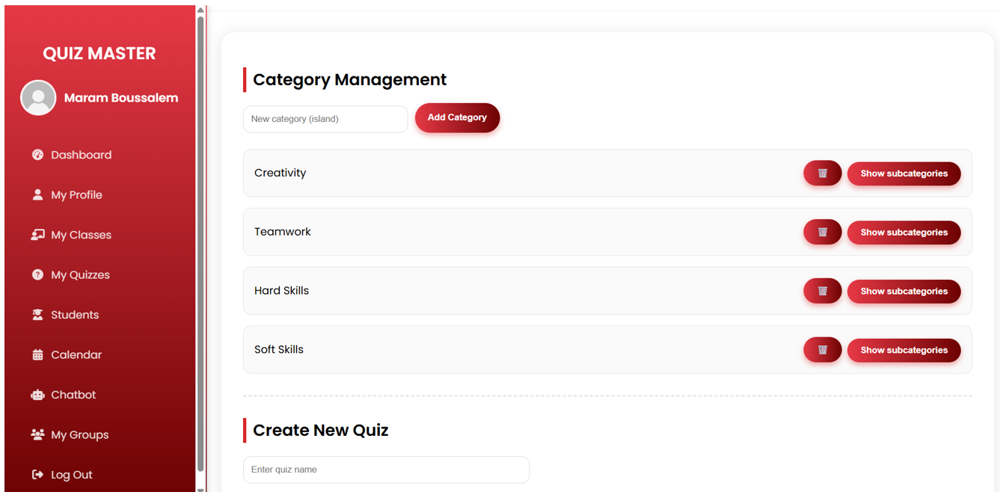
  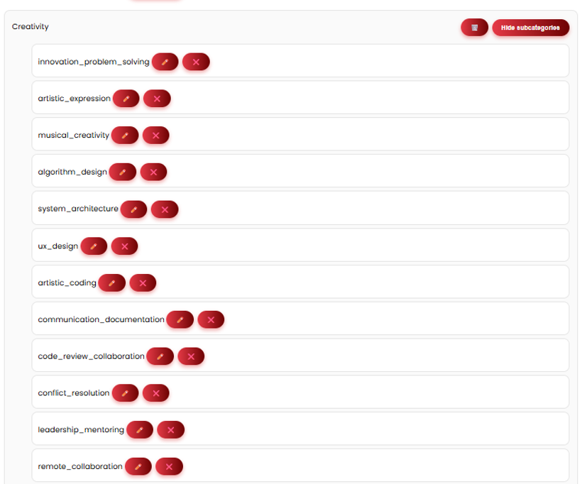
  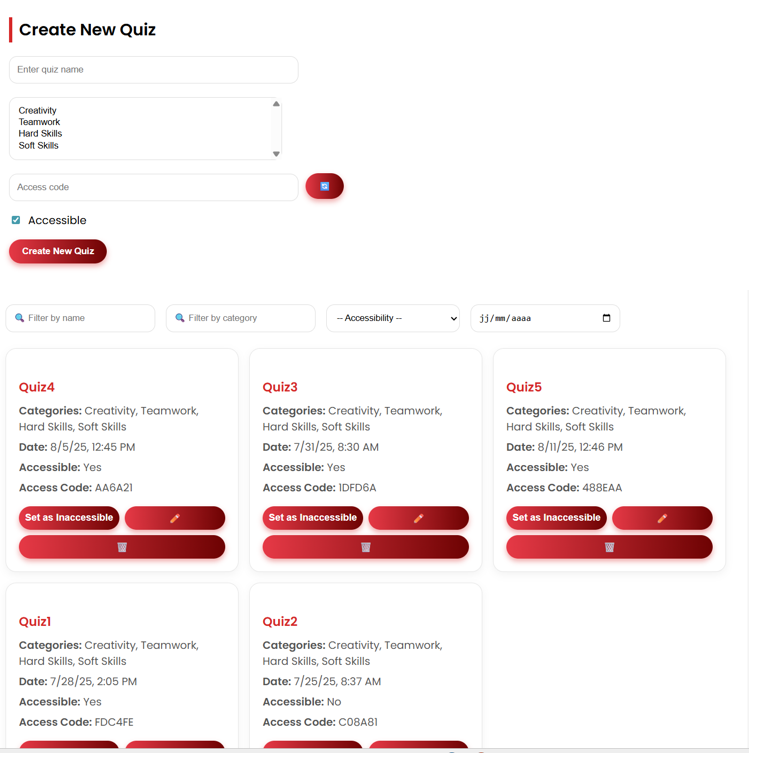
  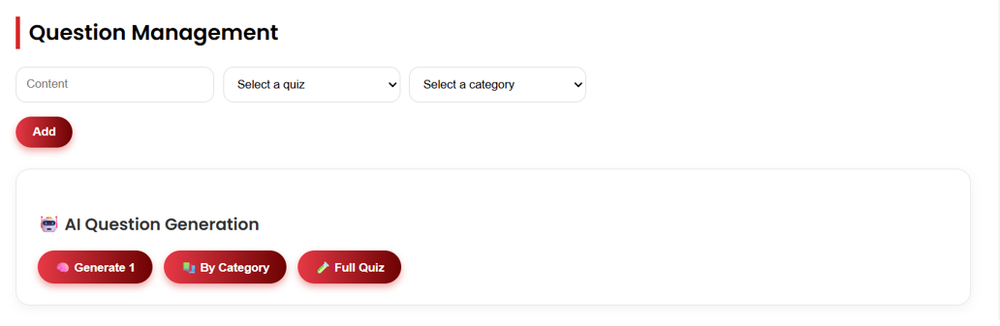
  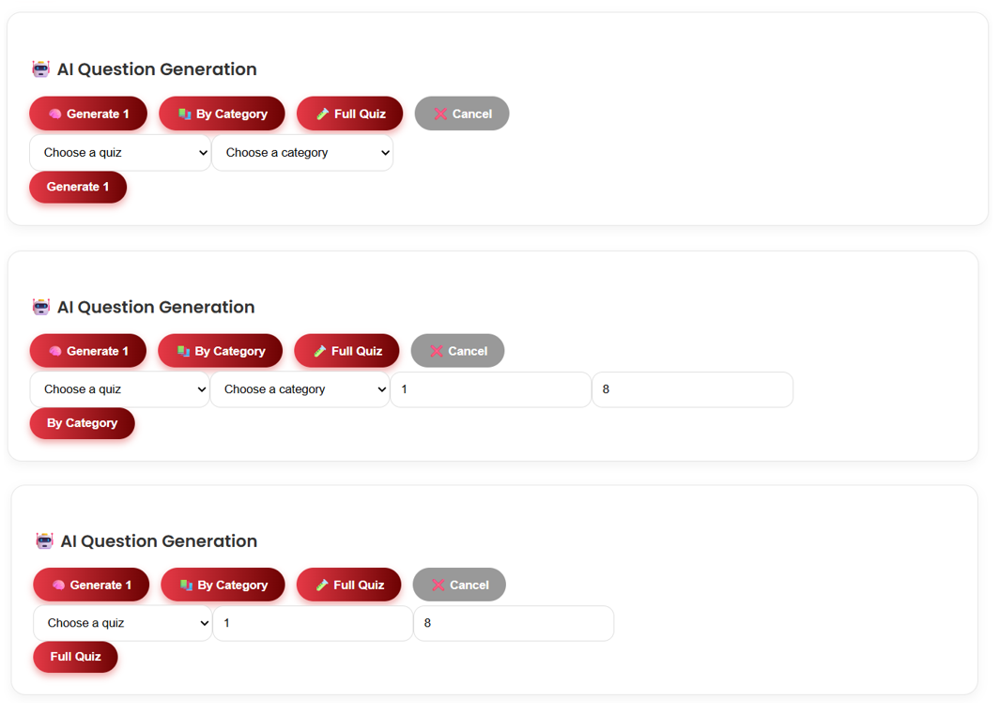
  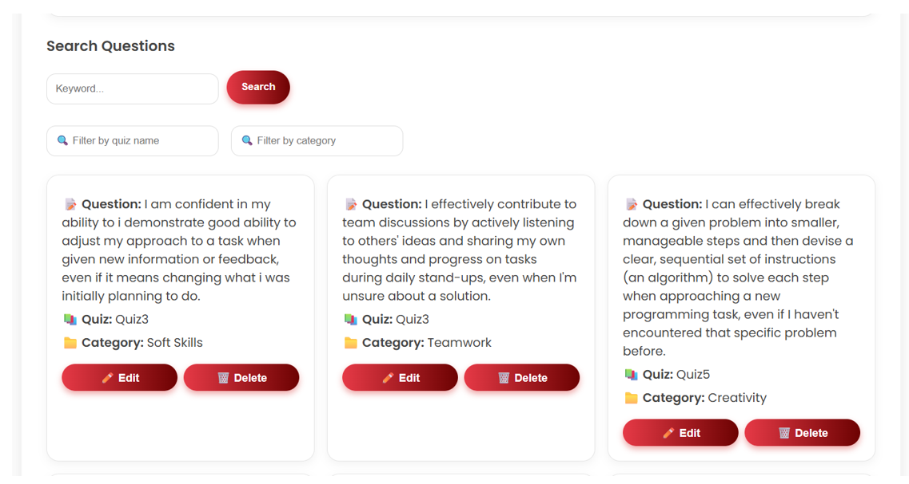

- **Students** :
  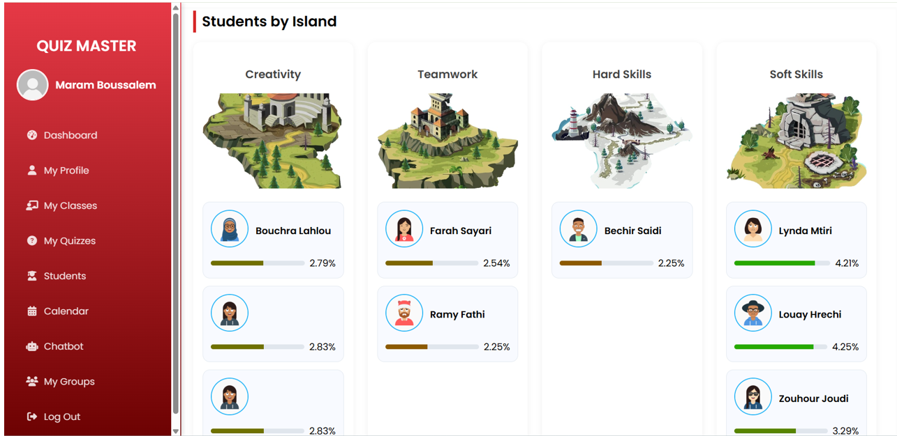
  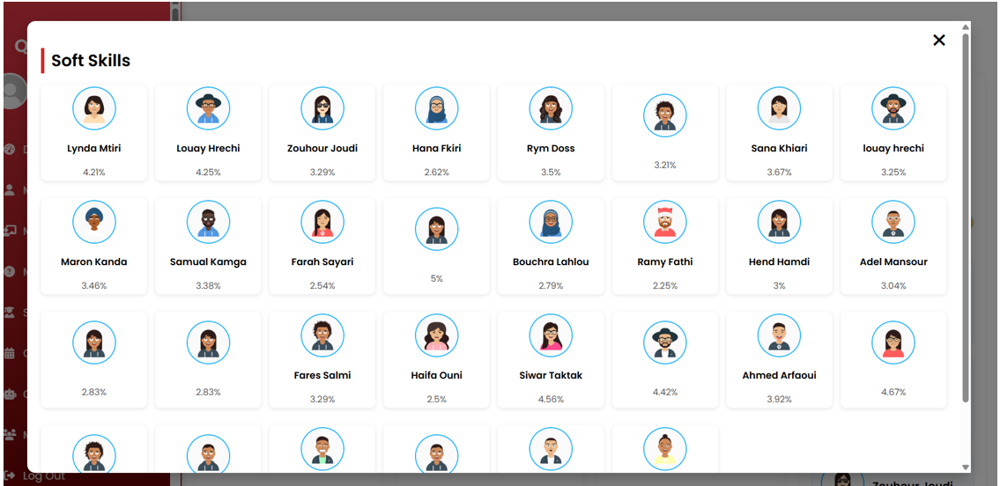
  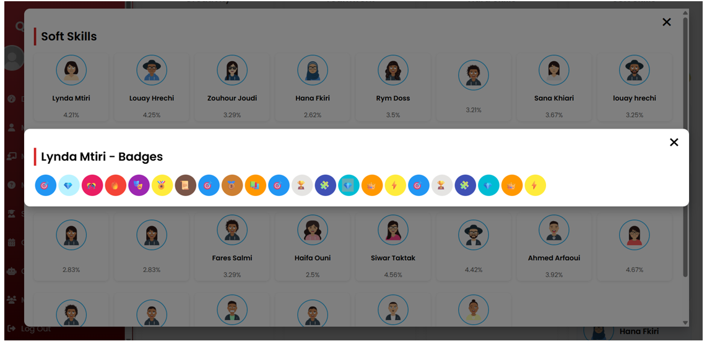
  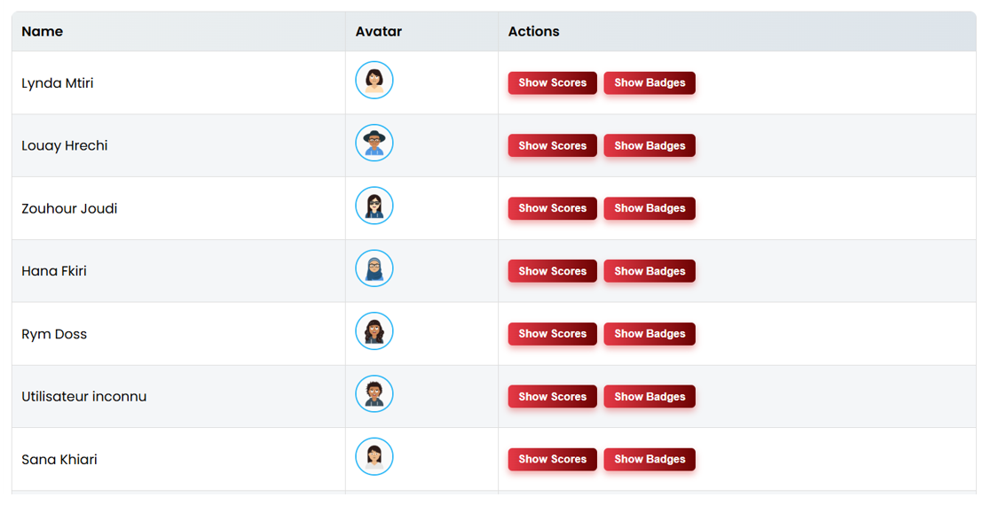
  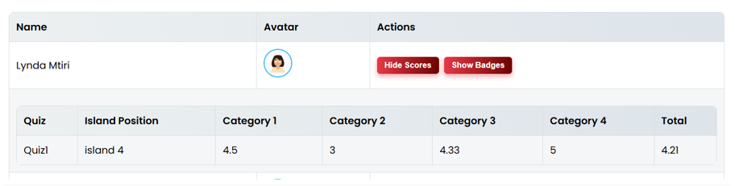
  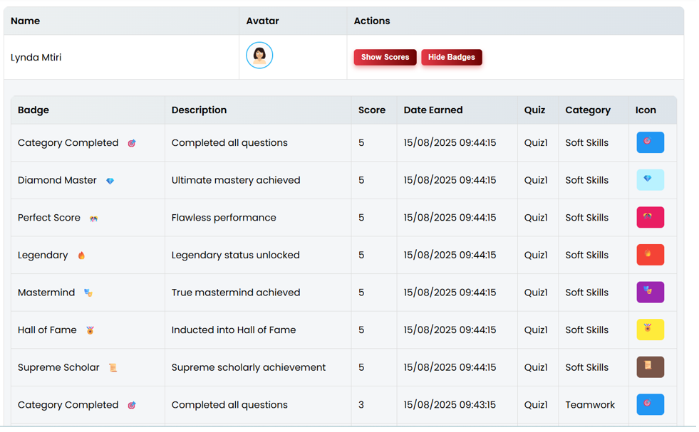

- **Calendar** : Calendrier des quiz avec FullCalendar.
  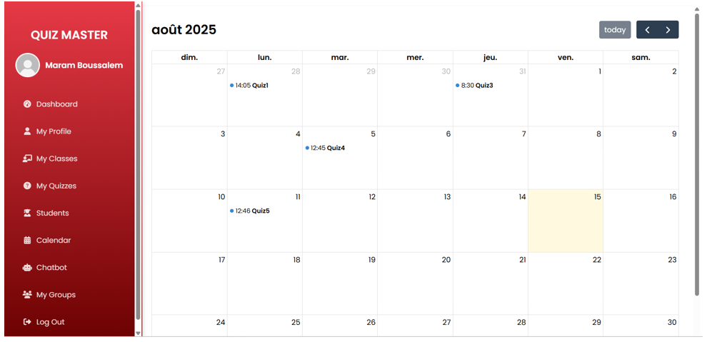

- **Chatbot** : Assistance via FAQ (mydata.json) + IA Gemini.
  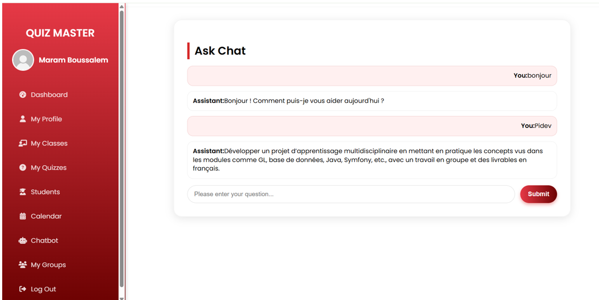
